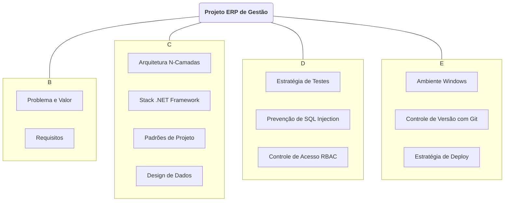
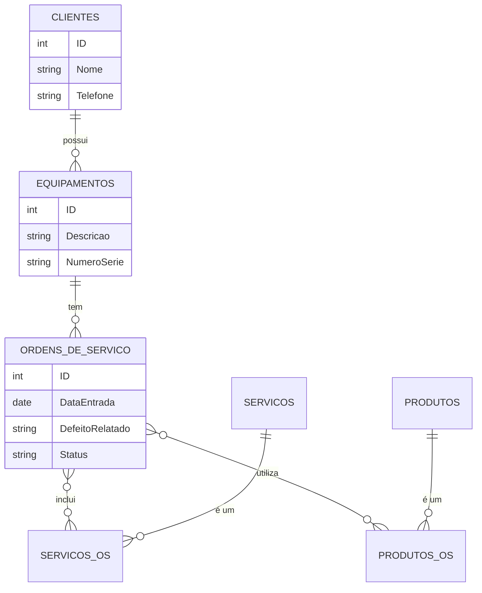
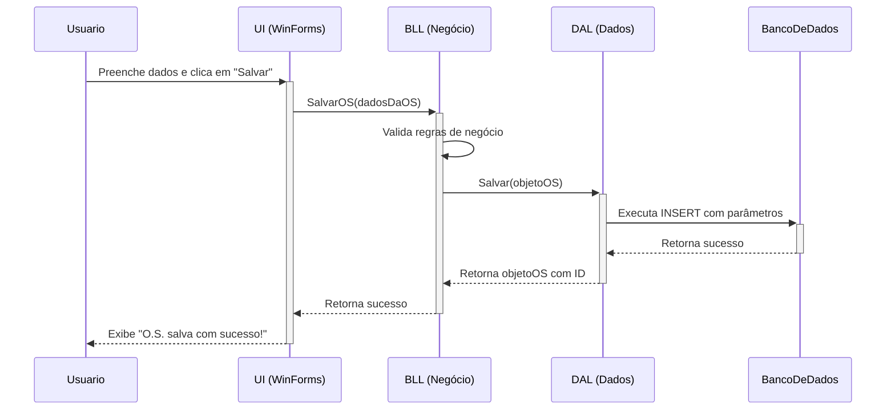

# ERP de Gestão Empresarial para Assistências Técnicas

**Sistema de gestão completo (ERP) desenvolvido em C# com Windows Forms e SQL Server, focado em automatizar e otimizar o fluxo de trabalho de assistências técnicas. Este projeto foi validado em um ambiente de produção real.**

---

### 🖼️ Galeria de Imagens

| Tela de Login e Controle de Acesso | Dashboard Principal | Cadastro de Ordem de Serviço |
| :--------------------------------: | :-------------------: | :--------------------------: |
|  |  |  |

---

### 📖 Índice

* [⭐ Status do Projeto](#-status-do-projeto)
* [🏛️ Arquitetura e Design](#-arquitetura-e-design)
* [🛡️ Considerações de Segurança](#️-considerações-de-segurança)
* [🛠️ Tecnologias Utilizadas](#️-tecnologias-utilizadas)
* [🧠 Desafios e Aprendizados](#-desafios-e-aprendizados)
* [🚀 Evolução e Modernização do Projeto](#-evolução-e-modernização-do-projeto)

---

### ⭐ Status do Projeto

Este sistema foi desenvolvido e implementado em um ambiente de negócio real, operando como a principal ferramenta de gestão de uma assistência técnica. Por ser um projeto **comprovado em produção**, ele representa uma solução de software estável, robusta e validada por usuários finais em suas rotinas diárias.

### 🏛️ Arquitetura e Design

A aplicação foi estruturada seguindo as melhores práticas de engenharia de software para garantir manutenibilidade, escalabilidade e segurança. Os diagramas gerados (Mermaid) abaixo, ilustram a arquitetura e o fluxo simplificado do sistema.

#### **Mapa Mental da Arquitetura**

> **Detalhe:** Para uma visão aprofundada, **[clique aqui para ver o mapa mental completo e detalhado](docs/mapa-mental-detalhado.png)**.

#### **Modelo de Entidade-Relacionamento**

#### **Diagrama de Sequência: Cadastro de Nova O.S.**

---

### 🛡️ Considerações de Segurança

A segurança foi um pilar fundamental durante o desenvolvimento. As seguintes medidas foram implementadas:

* **Prevenção Contra SQL Injection:** Toda a comunicação com o banco de dados é realizada através de **queries parametrizadas** (`SqlParameter`), conforme ilustrado no diagrama de sequência.
* **Controle de Acesso Baseado em Papéis (RBAC):** Foram implementados diferentes níveis de permissão (ex: Administrador, Técnico).
* **Gerenciamento de Segredos:** Strings de conexão são mantidas em arquivos de configuração (`app.config`) e não expostas no código-fonte.
* **Validação de Entrada:** Todos os dados são validados na camada de negócio (BLL) antes de serem persistidos.

---

### 🛠️ Tecnologias Utilizadas

* **Linguagem:** C#
* **Framework:** .NET Framework 3.5
* **Interface Gráfica:** Windows Forms
* **Banco de Dados:** SQL Server
* **Acesso a Dados:** ADO.NET
* **Testes:** xUnit
* **Planejamento:** Microsoft Project

---

### 🧠 Desafios e Aprendizados

* **Desafio:** Criar uma camada de dados flexível para não depender de um único SGBD.
    * **Solução:** A implementação dos padrões Repository e Abstract Factory se mostrou eficaz.
* **Desafio:** Notificar clientes sobre o status da O.S. sem APIs de mensagens acessíveis.
    * **Solução:** Foi desenvolvida uma automação criativa que solucionou o problema.

---

### 🚀 Evolução e Modernização do Projeto

Como parte de um contínuo processo de aprendizado, este projeto está sendo reimaginado com tecnologias mais atuais em dois novos showcases:

* **💻 Versão Desktop Moderna (WPF):** Uma reescrita da interface utilizando WPF e o padrão MVVM.
    * **[Ver o showcase da versão WPF (em desenvolvimento) ➞](https://github.com/NaassonRibeiro/erp-gestao-wpf-showcase)**

* **🌐 Plataforma de Serviços (ASP.NET):** O desenvolvimento de um backend com uma API RESTful utilizando ASP.NET Core e Clean Architecture.
    * **[Ver o showcase da versão ASP.NET (em desenvolvimento) ➞](https://github.com/NaassonRibeiro/erp-gestao-aspnet-showcase)**
