# ERP de Gestão Empresarial para Assistências Técnicas

**Sistema de gestão completo (ERP) desenvolvido em C# com Windows Forms e SQL Server, focado em automatizar e otimizar o fluxo de trabalho de assistências técnicas. Este projeto foi validado em um ambiente de produção real.**

---

### 🖼️ Galeria de Imagens

| Tela de Login e Controle de Acesso | Dashboard Principal | Cadastro de Ordem de Serviço |
| :--------------------------------: | :-------------------: | :--------------------------: |
|  |  |  |

---

### 📖 Índice

* [⭐ Status do Projeto](#-status-do-projeto)
* [🏛️ Arquitetura e Design](#-arquitetura-e-design)
* [🛡️ Considerações de Segurança](#️-considerações-de-segurança)
* [🛠️ Tecnologias Utilizadas](#️-tecnologias-utilizadas)
* [🧠 Desafios e Aprendizados](#-desafios-e-aprendizados)
* [🚀 Evolução e Modernização do Projeto](#-evolução-e-modernização-do-projeto)

---

### ⭐ Status do Projeto

Este sistema foi desenvolvido e implementado em um ambiente de negócio real, operando como a principal ferramenta de gestão de uma assistência técnica. Por ser um projeto **comprovado em produção**, ele representa uma solução de software estável, robusta e validada por usuários finais em suas rotinas diárias.

### 🏛️ Arquitetura e Design

A aplicação foi estruturada seguindo as melhores práticas de engenharia de software para garantir manutenibilidade, escalabilidade e segurança. Os diagramas gerados (Mermaid) abaixo, ilustram a arquitetura e o fluxo simplificado do sistema.

#### **Mapa Mental da Arquitetura**

```mermaid
graph TD
    %% Título Principal
    ERP("<b>Projeto ERP de Gestão</b>")

    %% Definição dos Títulos das Seções
    Cat1("<b>1. Visão e Escopo</b>")
    Cat2("<b>2. Arquitetura e Design</b>")
    Cat3("<b>3. Qualidade e Segurança</b>")
    Cat4("<b>4. Infra e Deploy</b>")

    %% Definição dos Itens de cada Seção
    subgraph " "
        Item1_1["Problema e Valor"]
        Item1_2["Requisitos"]
        
        Item2_1["Arquitetura N-Camadas"]
        Item2_2["Stack .NET Framework"]
        Item2_3["Padrões de Projeto"]
        Item2_4["Design de Dados"]
        
        Item3_1["Estratégia de Testes"]
        Item3_2["Prevenção de SQL Injection"]
        Item3_3["Controle de Acesso RBAC"]
        
        Item4_1["Ambiente Windows"]
        Item4_2["Controle de Versão com Git"]
        Item4_3["Estratégia de Deploy"]
    end

    %% Links - A Mágica para forçar a verticalidade
    ERP --> Cat1
    Cat1 --> Cat2
    Cat2 --> Cat3
    Cat3 --> Cat4

    %% Links dos Itens para suas respectivas categorias
    Cat1 --- Item1_1 & Item1_2

    Cat2 --- Item2_1 & Item2_2 & Item2_3 & Item2_4
    
    Cat3 --- Item3_1 & Item3_2 & Item3_3
    
    Cat4 --- Item4_1 & Item4_2 & Item4_3
    
    %% Estilos (Opcional, para deixar mais bonito)
    style ERP fill:#28a745,stroke:#fff,stroke-width:2px,color:#fff
    style Cat1 fill:#007bff,stroke:#fff,stroke-width:2px,color:#fff
    style Cat2 fill:#007bff,stroke:#fff,stroke-width:2px,color:#fff
    style Cat3 fill:#007bff,stroke:#fff,stroke-width:2px,color:#fff
    style Cat4 fill:#007bff,stroke:#fff,stroke-width:2px,color:#fff
```

> **Detalhe:** Para uma visão aprofundada, **[clique aqui para ver o mapa mental completo e detalhado](docs/mapa-mental-detalhado.png)**.

#### **Modelo de Entidade-Relacionamento**

#### **Diagrama de Sequência: Cadastro de Nova O.S.**

```mermaid
sequenceDiagram
    participant Usuario
    participant UI (WinForms)
    participant BLL (Negócio)
    participant DAL (Dados)
    participant BancoDeDados

    Usuario->>+UI (WinForms): Preenche dados e clica em "Salvar"
    UI (WinForms)->>+BLL (Negócio): SalvarOS(dadosDaOS)
    BLL (Negócio)->>BLL (Negócio): Valida regras de negócio
    BLL (Negócio)->>+DAL (Dados): Salvar(objetoOS)
    DAL (Dados)->>+BancoDeDados: Executa INSERT com parâmetros
    BancoDeDados-->>-DAL (Dados): Retorna sucesso
    DAL (Dados)-->>-BLL (Negócio): Retorna objetoOS com ID
    BLL (Negócio)-->>-UI (WinForms): Retorna sucesso
    UI (WinForms)-->>-Usuario: Exibe "O.S. salva com sucesso!"
```

---

### 🛡️ Considerações de Segurança

A segurança foi um pilar fundamental durante o desenvolvimento. As seguintes medidas foram implementadas:

* **Prevenção Contra SQL Injection:** Toda a comunicação com o banco de dados é realizada através de **queries parametrizadas** (`SqlParameter`), conforme ilustrado no diagrama de sequência.
* **Controle de Acesso Baseado em Papéis (RBAC):** Foram implementados diferentes níveis de permissão (ex: Administrador, Técnico).
* **Gerenciamento de Segredos:** Strings de conexão são mantidas em arquivos de configuração (`app.config`) e não expostas no código-fonte.
* **Validação de Entrada:** Todos os dados são validados na camada de negócio (BLL) antes de serem persistidos.

---

### 🛠️ Tecnologias Utilizadas

* **Linguagem:** C#
* **Framework:** .NET Framework 3.5
* **Interface Gráfica:** Windows Forms
* **Banco de Dados:** SQL Server
* **Acesso a Dados:** ADO.NET
* **Testes:** xUnit
* **Planejamento:** Microsoft Project

---

### 🧠 Desafios e Aprendizados

* **Desafio:** Criar uma camada de dados flexível para não depender de um único SGBD.
    * **Solução:** A implementação dos padrões Repository e Abstract Factory se mostrou eficaz.
* **Desafio:** Notificar clientes sobre o status da O.S. sem APIs de mensagens acessíveis.
    * **Solução:** Foi desenvolvida uma automação criativa que solucionou o problema.

---

### 🚀 Evolução e Modernização do Projeto

Como parte de um contínuo processo de aprendizado, este projeto está sendo reimaginado com tecnologias mais atuais em dois novos showcases:

* **💻 Versão Desktop Moderna (WPF):** Uma reescrita da interface utilizando WPF e o padrão MVVM.
    * **[Ver o showcase da versão WPF (em desenvolvimento) ➞](https://github.com/NaassonRibeiro/erp-gestao-wpf-showcase)**

* **🌐 Plataforma de Serviços (ASP.NET):** O desenvolvimento de um backend com uma API RESTful utilizando ASP.NET Core e Clean Architecture.
    * **[Ver o showcase da versão ASP.NET (em desenvolvimento) ➞](https://github.com/NaassonRibeiro/erp-gestao-aspnet-showcase)**
